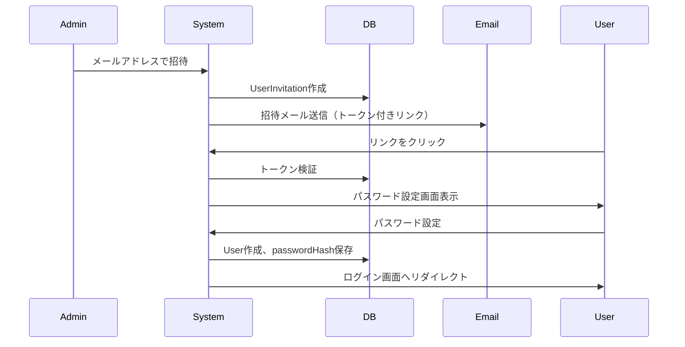
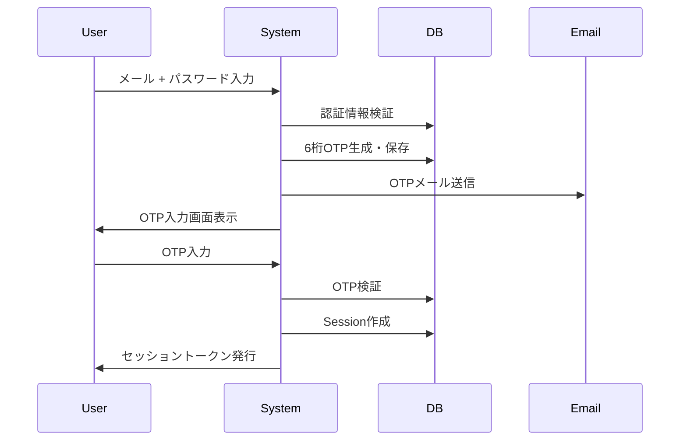

# 認証・認可システム設計

**作成日**: 2025-10-08
**目的**: 管理者・設定権限の2段階権限システムとメール認証ベースのログイン実装

## 概要

### 要件

1. **権限レベル**
   - **管理者権限**: Slackワークスペース設定の管理、メンバー管理
   - **設定権限**: 地震通知設定の編集、メッセージテンプレート編集

2. **認証フロー**
   - 初回登録: メールアドレス確認 → メールリンク → パスワード設定
   - ログイン: メール + パスワード → 6桁OTP送信 → OTP入力

3. **セキュリティ**
   - パスワード: bcrypt ハッシュ化
   - Bot Token: AES-256-GCM 暗号化（既存実装）
   - OTP: 有効期限5分、使い捨て

## データベーススキーマ

### users テーブル

```prisma
model User {
  id                String    @id @default(uuid())
  email             String    @unique
  passwordHash      String?   // null = 未設定（招待中）
  role              UserRole  @default(EDITOR)
  isActive          Boolean   @default(true)
  emailVerified     Boolean   @default(false)
  createdAt         DateTime  @default(now())
  updatedAt         DateTime  @updatedAt

  // リレーション
  sessions          Session[]
  otpCodes          OtpCode[]
  invitations       UserInvitation[]
}

enum UserRole {
  ADMIN      // 管理者権限: すべての設定可能
  EDITOR     // 設定権限: 地震通知設定のみ
}
```

### sessions テーブル

```prisma
model Session {
  id           String   @id @default(uuid())
  userId       String
  token        String   @unique
  expiresAt    DateTime
  createdAt    DateTime @default(now())

  user         User     @relation(fields: [userId], references: [id], onDelete: Cascade)

  @@index([userId])
  @@index([token])
}
```

### otp_codes テーブル

```prisma
model OtpCode {
  id           String   @id @default(uuid())
  userId       String
  code         String   // 6桁数字
  expiresAt    DateTime // 5分後
  used         Boolean  @default(false)
  createdAt    DateTime @default(now())

  user         User     @relation(fields: [userId], references: [id], onDelete: Cascade)

  @@index([userId])
  @@index([code, expiresAt])
}
```

### user_invitations テーブル

```prisma
model UserInvitation {
  id              String   @id @default(uuid())
  email           String
  invitedBy       String
  token           String   @unique
  role            UserRole @default(EDITOR)
  expiresAt       DateTime // 7日後
  acceptedAt      DateTime?
  createdAt       DateTime @default(now())

  inviter         User     @relation(fields: [invitedBy], references: [id])

  @@index([email])
  @@index([token])
}
```

## 認証フロー詳細

### 1. 初回招待フロー



### 2. ログインフロー（2段階認証）



## 画面構成

### 1. ログイン画面 (`/login`)

- メールアドレス入力
- パスワード入力
- ログインボタン
- 「招待メールを受け取った方はこちら」リンク

### 2. OTP入力画面 (`/login/verify`)

- 6桁コード入力フィールド
- 「再送信」ボタン
- カウントダウンタイマー（5分）

### 3. 招待受諾画面 (`/invitation/[token]`)

- メールアドレス表示（readonly）
- パスワード入力
- パスワード確認入力
- 「アカウント作成」ボタン

### 4. 管理者ダッシュボード (`/admin`)

**アクセス**: 管理者権限のみ

- Slackワークスペース管理
  - ワークスペース追加/編集/削除
  - Bot Token設定（暗号化保存）
- メンバー管理
  - メンバー招待
  - 権限変更
  - 無効化/有効化
- 既存データ移行
  - IndexedDB → PostgreSQL 移行UI

### 5. 設定ダッシュボード (`/settings`)

**アクセス**: 設定権限 + 管理者権限

- 地震通知設定
  - 最小震度設定
  - 対象都道府県選択
  - 通知チャンネル設定
- メッセージテンプレート編集
  - Slack Blocks形式
  - プレビュー機能

## API エンドポイント

### 認証API

| エンドポイント | メソッド | 説明 |
|--------------|---------|------|
| `/api/auth/login` | POST | メール+パスワード認証、OTP送信 |
| `/api/auth/verify-otp` | POST | OTP検証、セッション作成 |
| `/api/auth/logout` | POST | セッション削除 |
| `/api/auth/session` | GET | 現在のセッション情報取得 |

### 招待API

| エンドポイント | メソッド | 説明 |
|--------------|---------|------|
| `/api/invitations` | POST | ユーザー招待 (Admin only) |
| `/api/invitations/verify` | GET | 招待トークン検証 |
| `/api/invitations/accept` | POST | 招待受諾、パスワード設定 |

### ユーザー管理API

| エンドポイント | メソッド | 説明 |
|--------------|---------|------|
| `/api/users` | GET | ユーザー一覧 (Admin only) |
| `/api/users/:id` | PATCH | ユーザー更新 (Admin only) |
| `/api/users/:id/toggle-active` | POST | 有効/無効切替 (Admin only) |

### Slack設定API

| エンドポイント | メソッド | 説明 |
|--------------|---------|------|
| `/api/admin/slack/workspaces` | GET/POST | ワークスペース管理 (Admin only) |
| `/api/admin/slack/workspaces/:id` | PATCH/DELETE | ワークスペース編集/削除 (Admin only) |
| `/api/settings/notifications` | GET/PATCH | 地震通知設定 (Editor + Admin) |

## メール送信

### メールサービス選定

**推奨**: Resend (https://resend.com)

理由:
- Next.js公式推奨
- 無料枠: 100通/日
- シンプルなAPI
- TypeScript SDK提供

### メールテンプレート

#### 1. 招待メール

```
件名: 【安否確認システム】招待のご案内

{inviterName} さんから、安否確認システムへの招待が届いています。

以下のリンクから、アカウントを作成してください：
{invitationLink}

このリンクは7日間有効です。

---
安否確認システム
```

#### 2. OTPメール

```
件名: 【安否確認システム】ログイン認証コード

ログイン認証コード:

{otpCode}

このコードは5分間有効です。
第三者に共有しないでください。

---
安否確認システム
```

## セキュリティ対策

1. **パスワード**
   - bcrypt でハッシュ化（saltRounds: 10）
   - 最小8文字、英数字記号を推奨

2. **セッション管理**
   - セッショントークン: uuid v4
   - 有効期限: 7日
   - HTTPOnly Cookie推奨

3. **OTP**
   - 6桁数字ランダム生成
   - 有効期限: 5分
   - 1回限り使用
   - 3回失敗でロック検討

4. **招待トークン**
   - uuid v4
   - 有効期限: 7日
   - 1回限り使用

## 実装順序

1. ✅ Prismaスキーマ更新、マイグレーション作成
2. ✅ 認証ミドルウェア実装
3. ✅ メール送信サービス統合
4. ✅ 招待フロー実装（API + UI）
5. ✅ ログインフロー実装（API + UI）
6. ✅ 管理者ダッシュボード実装
7. ✅ 設定ダッシュボード実装
8. ✅ 既存データ移行UI統合

## 環境変数

```env
# メール送信（Resend）
RESEND_API_KEY=re_xxxxxxxxxxxx

# セッション管理
SESSION_SECRET=<32byte-random-string>

# システム設定
SYSTEM_EMAIL_FROM=noreply@yourdomain.com
INVITATION_EXPIRY_DAYS=7
OTP_EXPIRY_MINUTES=5
SESSION_EXPIRY_DAYS=7
```

## 初期セットアップ

### 初回管理者作成

開発環境でのみ使用する管理者作成スクリプト:

```bash
docker-compose exec anpikakunin npx ts-node scripts/create-admin.ts
```

入力:
- メールアドレス
- パスワード

これで最初の管理者アカウントが作成され、以降は画面から招待可能。
